<div align="center">

# 🌱 Sasya AI · The Future Grows Here

### *The Future Grows Here — AI-Powered Farming for Every Indian Farmer*

[](https://github.com/krushit1307/TETRA042)
[](https://github.com/krushit1307/TETRA042)
[](https://github.com/krushit1307/TETRA042)
[](https://neel2601-sasya-ai-backend.hf.space/docs)


<br/>

**🌐 Web** · **📱 Android APK** · **💬 WhatsApp** · **🎙️ Live Voice AI**

| 🔗 Resource | URL |
|-------------|-----|
| **Live Backend** | https://neel2601-sasya-ai-backend.hf.space |
| **API Docs** | https://neel2601-sasya-ai-backend.hf.space/docs |
| **GitHub** | https://github.com/krushit1307/TETRA042 |
| **Contact** | sasyaaihelp@gmail.com |

<br/>

[Overview](#-overview) ·
[Architecture](#-system-architecture) ·
[Features](#-platform-features) ·
[Mobile App](#-mobile-app) ·
[WhatsApp](#-whatsapp-agent) ·
[Models](#-ai-models) ·
[Quick Start](#-quick-start) ·
[Team](#-team-tetra042)

</div>

---

## 🌾 Overview

**Sasya AI** is a full-stack, multilingual AgriTech platform built for **TetraTHON 2026** by **Team TETRA042**.  
The farmer-facing brand is **KrishiMitra** (कृषि मित्र — *Farming Friend*).

We bring **four fine-tuned AI models** together in one pipeline — so farmers can diagnose crop diseases, get expert advice, check mandi prices, and plan sowing — in **10 Indian languages**, via **web, mobile, voice, or WhatsApp**.

<div align="center">

### 🏠 Home — KrishiMitra Web Platform

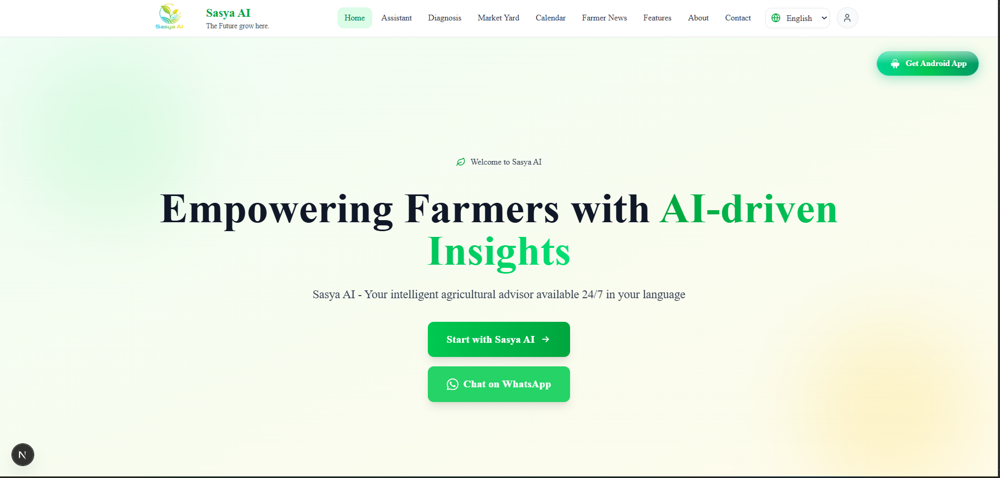

| What you see | Overview |
|--------------|----------|
| **Hero section** | Welcome message, AI-driven insights tagline, CTA to start or chat on WhatsApp |
| **Navigation** | Assistant · Diagnosis · Market Yard · Calendar · Farmer News · Features · About · Contact |
| **Android App** | One-tap download for the Capacitor mobile APK |
| **10 languages** | Full UI localization for Indian farmers |

</div>

---

## 🏗 System Architecture

One unified backend serves every channel — web, mobile, WhatsApp, and voice — with the same AI pipeline.

<div align="center">

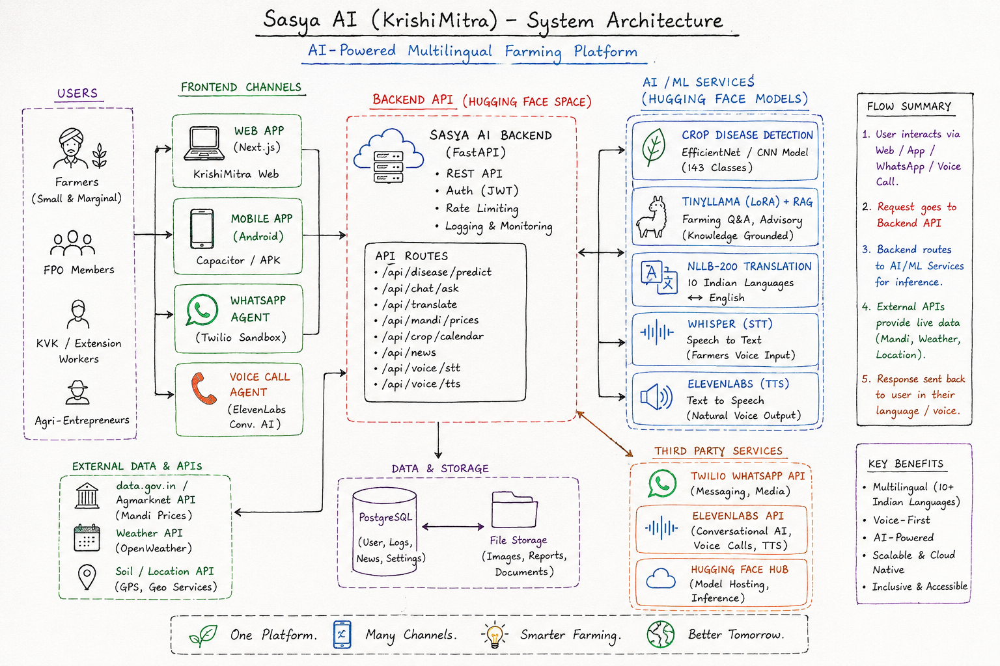

</div>

| Layer | Components |
|-------|------------|
| **Users** | Farmers · FPO members · KVK workers · Agri-entrepreneurs |
| **Channels** | Next.js Web · Capacitor APK · Twilio WhatsApp · ElevenLabs Voice |
| **Backend** | FastAPI on Hugging Face — REST API, auth, logging |
| **AI / ML** | EfficientNet CNN · TinyLlama+LoRA+RAG · NLLB-200 · Whisper · ElevenLabs TTS |
| **Data** | Agmarknet API · agricultural KB · disease_info · crop calendar |
| **Flow** | User → API → AI inference + live data → response in native language |

<details>
<summary><b>📊 Mermaid — Advisory Pipeline (click to expand)</b></summary>

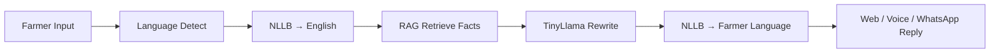

</details>

---

## ✨ Platform Features

---

### 💬 AI Agricultural Assistant

24/7 multilingual chat — ask about crops, diseases, irrigation, fertilizers, or markets.  
Supports **voice input**, **TTS playback**, and **local GPU** acceleration.

<div align="center">

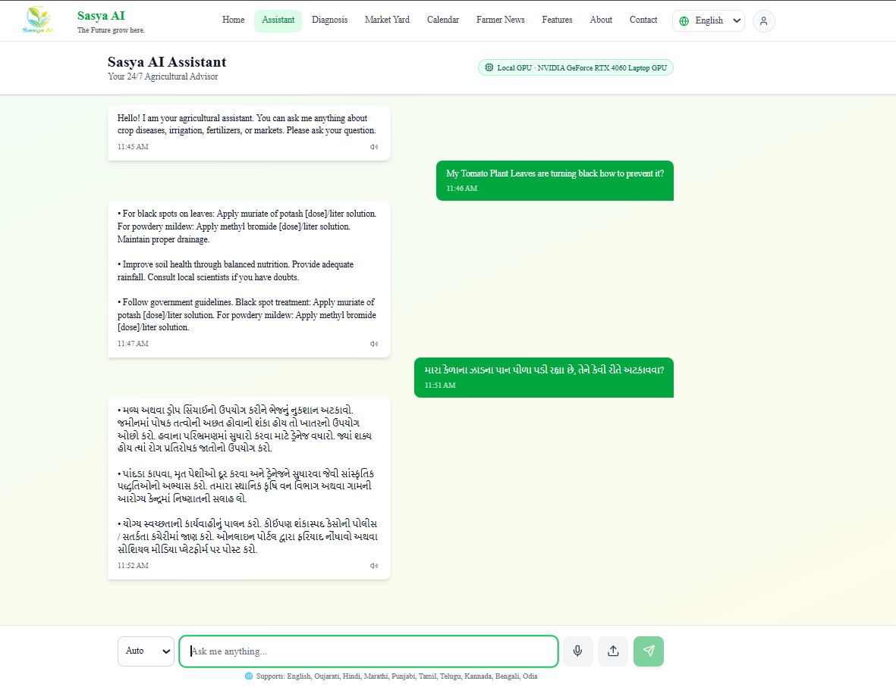

</div>

| Feature | Detail |
|---------|--------|
| **Multilingual chat** | English, Hindi, Gujarati, Marathi, Punjabi, Tamil, Telugu, Kannada, Bengali, Odia |
| **Voice input** | Mic → Whisper STT → AI answer → TTS playback |
| **Grounded answers** | RAG + TinyLlama — facts only, no hallucination |
| **GPU badge** | Shows Local GPU / HF Cloud status in real time |
| **Speaker icon** | Tap to hear any AI reply aloud |

---

### 🔬 Crop Disease Diagnosis

Upload a leaf photo → **EfficientNet-V2 CNN** identifies disease → cause, treatment, prevention in farmer's language.

<div align="center">

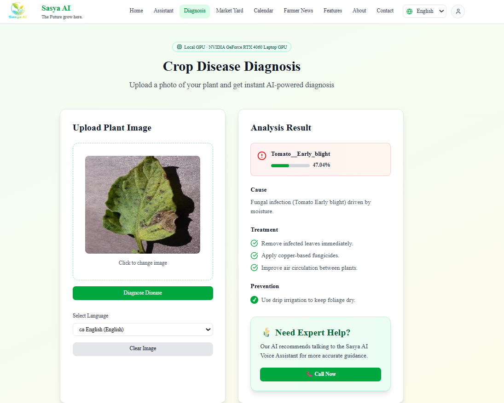

</div>

| Feature | Detail |
|---------|--------|
| **143 disease classes** | Team-trained CNN on Hugging Face (`Neel2601/sasya-disease-v2`) |
| **Confidence score** | Transparent % with high / medium / low bands |
| **Treatment plan** | Step-by-step cause, treatment, prevention |
| **Expert escalation** | Low confidence → **Call Now** for live voice assistant |
| **Multilingual** | Results translated via NLLB-200 |

---

### 🎙️ Live Voice Assistant (ElevenLabs)

Real-time conversational AI call after diagnosis — speak naturally, get spoken expert guidance.

<div align="center">

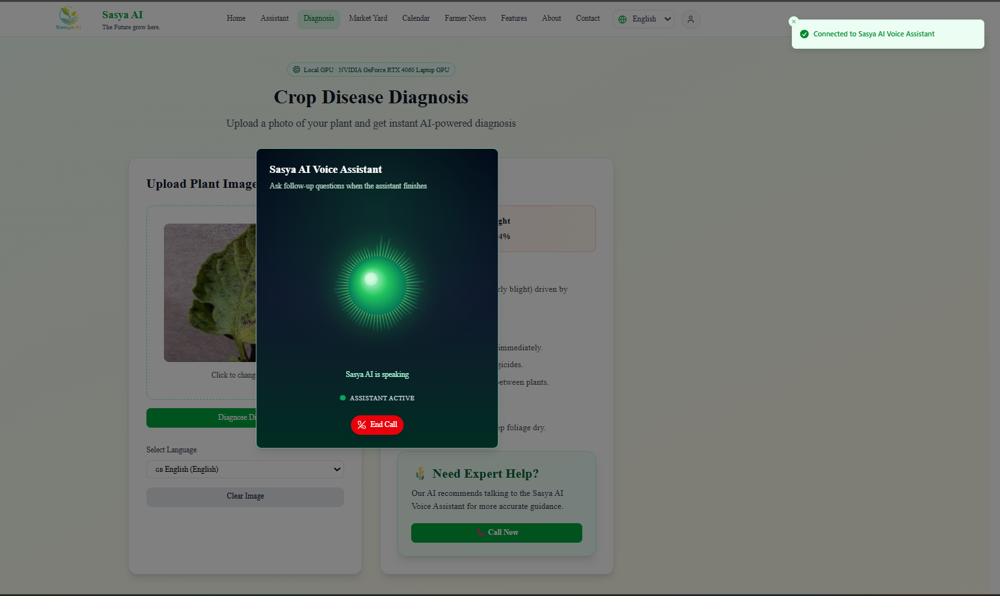

</div>

| Feature | Detail |
|---------|--------|
| **ElevenLabs ConvAI** | Live WebSocket voice session with farming context |
| **Post-diagnosis call** | Crop + disease + confidence passed to voice agent |
| **Visual feedback** | Animated orb shows assistant is listening / speaking |
| **Follow-up questions** | Ask treatment details by voice after diagnosis |
| **Connected toast** | Instant confirmation when call connects |

---

### 📈 Market Yard — Live Mandi Prices

Real-time crop prices from **data.gov.in / Agmarknet** — state → district → APMC → commodity.

<div align="center">

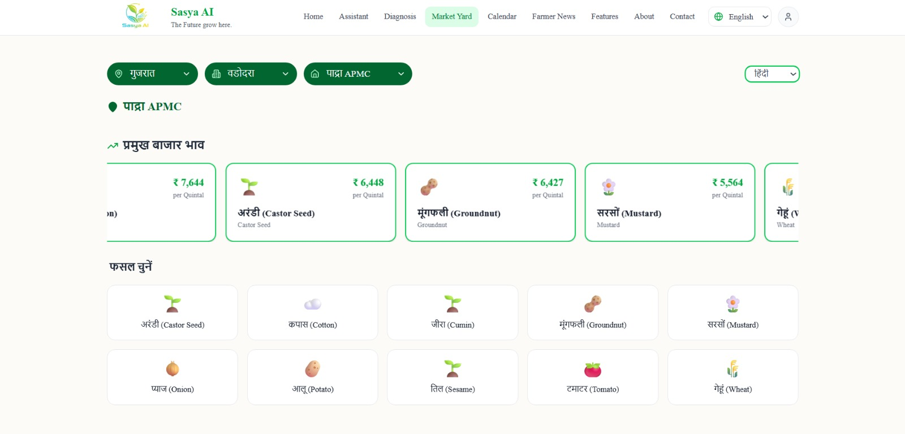

</div>

| Feature | Detail |
|---------|--------|
| **Live Agmarknet data** | Authorized government API |
| **3-level drill-down** | State / District / APMC market |
| **Top prices carousel** | Castor, Groundnut, Mustard, Cotton, and more |
| **Crop grid** | Tap any crop for detailed price breakdown |
| **Hindi + Gujarati UI** | Localized labels for regional farmers |
| **Fallback data** | Works even when API is slow |

---

### 📅 Smart Crop Calendar

Year-round sowing & harvesting guide — filter by **state, soil type, and season**.

<div align="center">

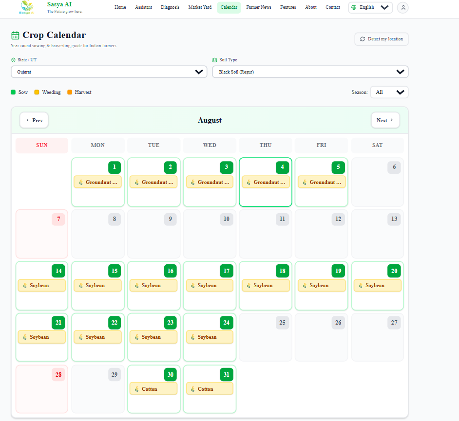

</div>

| Feature | Detail |
|---------|--------|
| **All Indian states** | State / UT selector with GPS auto-detect |
| **Soil types** | Black, red, alluvial, laterite, and more |
| **Season filter** | Kharif · Rabi · Zaid · All |
| **Monthly grid** | Color-coded sow, weed, harvest activities |
| **Crop tags** | Groundnut, Soybean, Cotton, Wheat, etc. per date |

---

### 📰 Farmer News

Curated agricultural news — schemes, weather alerts, crop advisories, policy updates.

<div align="center">

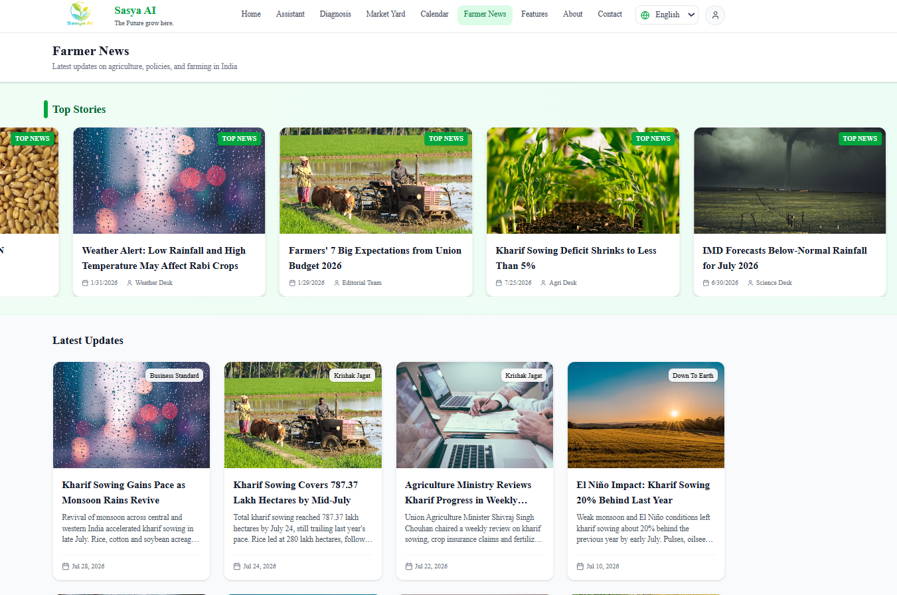

</div>

| Feature | Detail |
|---------|--------|
| **Top stories carousel** | Highlighted breaking agri news |
| **Latest updates grid** | Business Standard, Krishak Jagat, Down To Earth sources |
| **Admin CMS** | Team can add / edit news articles |
| **Multilingual** | News in farmer's selected language |
| **Categories** | Weather · Policy · Crop progress · Budget |

---

### 📱 Mobile App (Android APK)

Full-featured **Capacitor Android app** — same power as web, in your pocket.

<div align="center">

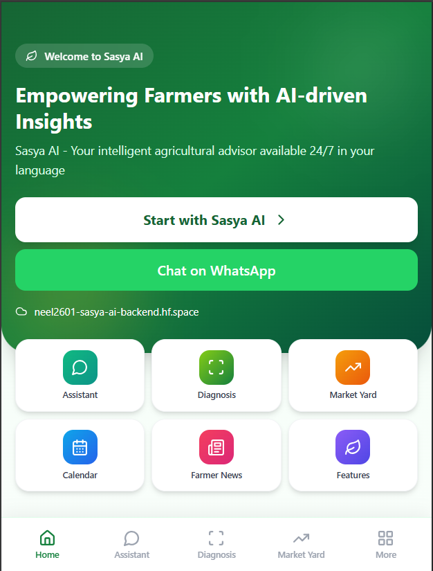

</div>

| Screen | Feature |
|--------|---------|
| **Home** | Hero, quick links, feature cards, WhatsApp CTA |
| **Assistant** | Chat + voice + ElevenLabs live call |
| **Diagnosis** | Camera capture → disease result |
| **Mandi** | Full market yard flow |
| **More** | News · Calendar · Features · About · Contact · Settings |
| **Package** | `com.sasyaai.mobile` · Capacitor 8 · Vite + React |

---

### 💬 WhatsApp Agent

Zero-install farming AI — farmers message or send crop photos on WhatsApp.

#### Onboarding & Chat Assistant

<div align="center">

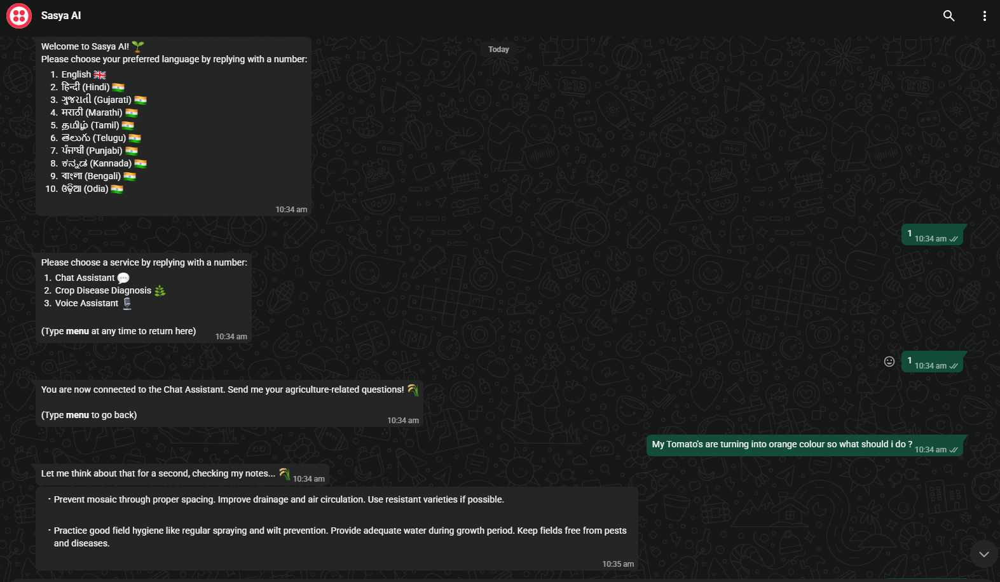

</div>

| Step | What happens |
|------|--------------|
| **1. Language** | Choose from 10 Indian languages |
| **2. Service menu** | Chat Assistant · Disease Diagnosis · Voice Assistant |
| **3. Chat** | Ask any farming question — grounded AI reply in bullets |
| **4. Menu anytime** | Type `menu` to return to main menu |

#### Crop Disease via WhatsApp Photo

<div align="center">

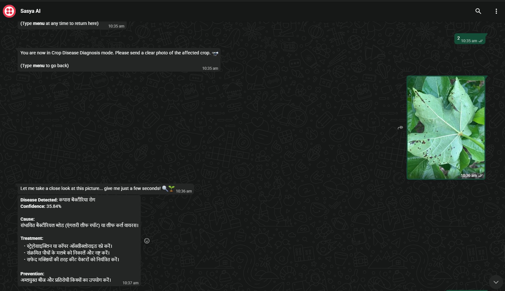

</div>

| Step | What happens |
|------|--------------|
| **Send photo** | Farmer sends clear crop leaf image |
| **AI analyzes** | Same CNN pipeline as web diagnosis |
| **Hindi reply** | Disease name, confidence, cause, treatment, prevention |
| **Instant** | No app install — works on any WhatsApp phone |

---

## 🤖 AI Models

| # | Model | Role | Hugging Face |
|---|-------|------|--------------|
| 1 | **EfficientNet-V2-S** | Crop disease CNN (143 classes) | `Neel2601/sasya-disease-v2` |
| 2 | **TinyLlama-1.1B + LoRA** | Agricultural advisory (RAG-grounded) | `Neel2601/tinyllama-agricultural-adapter` |
| 3 | **NLLB-200-distilled-600M** | 10-language translation | `facebook/nllb-200-distilled-600M` |
| 4 | **Whisper-small** | Speech-to-text (voice input) | `openai/whisper-small` |

**TTS chain:** ElevenLabs → edge-tts → gTTS (automatic fallback)

| Setting | Value |
|---------|-------|
| Advisory temperature | `0.4` (facts only) |
| Web max tokens | `320` |
| WhatsApp max tokens | `120` |
| Voice max tokens | `70` |
| Confidence escalation | < 70% → recommend voice expert call |

---

## 🛠 Tech Stack

| Layer | Technologies |
|-------|-------------|
| **Frontend** | Next.js 16 · React 18 · TypeScript · Tailwind · Framer Motion |
| **Mobile** | Capacitor 8 · Vite · React · Android APK |
| **Backend** | FastAPI · PyTorch · Gradio · Docker |
| **Voice** | ElevenLabs ConvAI · Whisper · edge-tts · gTTS |
| **WhatsApp** | Twilio webhook → Sasya AI pipeline |
| **Mandi** | data.gov.in Agmarknet API |
| **Deploy** | Hugging Face Spaces (backend) · Vercel (frontend) |

---

## 📁 Repository Structure

```
TETRA042/
├── public/                    # Screenshots & architecture diagram (this README)
├── frontend/                  # KrishiMitra web app (Next.js)
│   ├── app/api/whatsapp/      # Twilio WhatsApp webhook
│   ├── app/market-yard/       # Mandi prices
│   ├── app/calendar/          # Crop calendar
│   ├── app/news/              # Farmer news + admin
│   └── components/pages/      # Assistant, diagnosis, home…
├── mobileapp/                 # Capacitor Android APK
│   └── android/               # Gradle project → app-debug.apk
├── backend/                   # Sasya AI API (FastAPI + Gradio)
│   ├── app/services/          # disease, chat, advisory, tts, speech
│   └── space.py               # Hugging Face entry point
└── TETRA042_COMPLETE_DOCUMENT.md   # Full hackathon project document
```

---

## 🚀 Quick Start

### Frontend (uses hosted backend)

```bash
cd frontend
npm install
cp .env.example .env.local
```

```env
NEXT_PUBLIC_API_URL=https://neel2601-sasya-ai-backend.hf.space
NEXT_PUBLIC_DATA_GOV_API_KEY=your-data-gov-api-key
```

```bash
npm run dev
# → http://localhost:3000
```

### Backend (local GPU — optional)

```bash
cd backend
python -m venv .venv
.venv\Scripts\activate
pip install -r requirements.txt
pip install torch torchvision --index-url https://download.pytorch.org/whl/cu124
python -m uvicorn space:app --host 0.0.0.0 --port 7860
# → http://localhost:7860/docs
```

### Mobile APK

```bash
cd mobileapp
npm install
npm run build
npx cap sync android
cd android && .\gradlew assembleDebug
# APK → mobileapp/android/app/build/outputs/apk/debug/app-debug.apk
```

> **Tip:** First chat request loads TinyLlama (~1–3 min). Send one test message before demo.

---

## 🔑 Environment Variables

<details>
<summary><b>Frontend — frontend/.env.local</b></summary>

| Variable | Required | Description |
|----------|----------|-------------|
| `NEXT_PUBLIC_API_URL` | ✅ | Sasya AI backend URL |
| `NEXT_PUBLIC_DATA_GOV_API_KEY` | ✅ Mandi | data.gov.in API key |
| `TWILIO_ACCOUNT_SID` | WhatsApp | Twilio account SID |
| `TWILIO_AUTH_TOKEN` | WhatsApp | Twilio auth token |
| `ELEVENLABS_API_KEY` | Voice | ElevenLabs API key |
| `ELEVENLABS_ADVISORY_AGENT_ID` | Voice | Advisory agent ID |
| `ELEVENLABS_DIAGNOSIS_AGENT_ID` | Voice | Diagnosis agent ID |

</details>

<details>
<summary><b>Backend — backend/.env</b></summary>

| Variable | Description |
|----------|-------------|
| `HF_TOKEN` | Hugging Face token (private repos) |
| `ELEVENLABS_API_KEY` | Premium TTS |
| `USE_WHISPER_FINETUNE` | `1` = use fine-tuned Whisper |
| `PORT` | Default `7860` |

</details>

---

## 🌐 Backend API

**Base:** `https://neel2601-sasya-ai-backend.hf.space`

| Endpoint | Method | Description |
|----------|--------|-------------|
| `/health` | GET | Model status + GPU info |
| `/image-diagnosis` | POST | Leaf photo → disease JSON |
| `/chat` | POST | Text Q&A (`channel=web/whatsapp/voice`) |
| `/speech-to-text` | POST | Audio → transcript |
| `/text-to-speech` | POST | Text → MP3 |
| `/voice-chat` | POST | Audio → spoken answer |
| `/voice-diagnosis` | POST | Audio + image → diagnosis |

📖 **Interactive docs:** https://neel2601-sasya-ai-backend.hf.space/docs

---

## 🚢 Deployment

| Component | Platform | URL |
|-----------|----------|-----|
| **Backend** | Hugging Face Spaces | https://neel2601-sasya-ai-backend.hf.space |
| **Frontend** | Vercel / static export | Deploy `frontend/` |
| **Mobile** | Android APK sideload | `mobileapp/android/.../app-debug.apk` |
| **WhatsApp** | Twilio Sandbox | Webhook → `/api/whatsapp` |

---

## 👥 Team TETRA042

**TetraTHON 2026 · AgriTech · Navrachana University, Vadodara**

| Role | Focus |
|------|-------|
| **Team Lead / PM** | Coordination · Pitch · Strategy |
| **AI / ML Engineer** | Disease CNN · TinyLlama LoRA · RAG · NLLB · Whisper |
| **Backend Engineer** | FastAPI · Hugging Face deploy · API design |
| **Frontend Engineer** | Next.js · i18n · UI/UX · Market · Calendar · News |
| **Mobile / Voice / WhatsApp** | Capacitor APK · ElevenLabs · Twilio integration |
| **Agri Domain / QA** | Crop data · Testing · Farmer UX |

📄 **Full project document:** [TETRA042_COMPLETE_DOCUMENT.md](./TETRA042_COMPLETE_DOCUMENT.md)

---

## 📸 Screenshots Index

| Image | Section |
|-------|---------|
| `public/HomePage.png` | Home / Overview |
| `public/ArchitectureDiagram.png` | System Architecture |
| `public/AssistantPage.png` | AI Assistant |
| `public/Disease.png` | Crop Disease Diagnosis |
| `public/LiveVoiceAssistant.png` | Live Voice Call |
| `public/MarketMandi.png` | Market Yard / Mandi |
| `public/CropCalender.png` | Crop Calendar |
| `public/FarmerNews.png` | Farmer News |
| `public/MobileApp.png` | Android Mobile App |
| `public/WhatsappAssistant1.png` | WhatsApp Chat |
| `public/WhatsappAssistant2.png` | WhatsApp Disease Diagnosis |

---

<div align="center">

### 🌱 *Empowering Farmers with AI-driven Insights*

**One Platform · Many Channels · Smarter Farming · Better Tomorrow**

<br/>

[](https://github.com/krushit1307/TETRA042)
[](https://neel2601-sasya-ai-backend.hf.space)
[](https://github.com/krushit1307/TETRA042)
[](https://github.com/krushit1307/TETRA042)

<br/>

*Built with ❤️ by Team TETRA042 for TetraTHON 2026*

*Navrachana Innovation Foundation · Indo-French AI Innovation Sprint*

</div>
