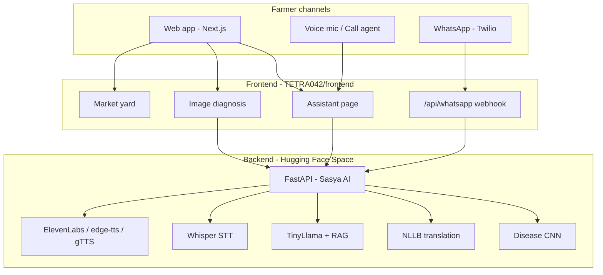
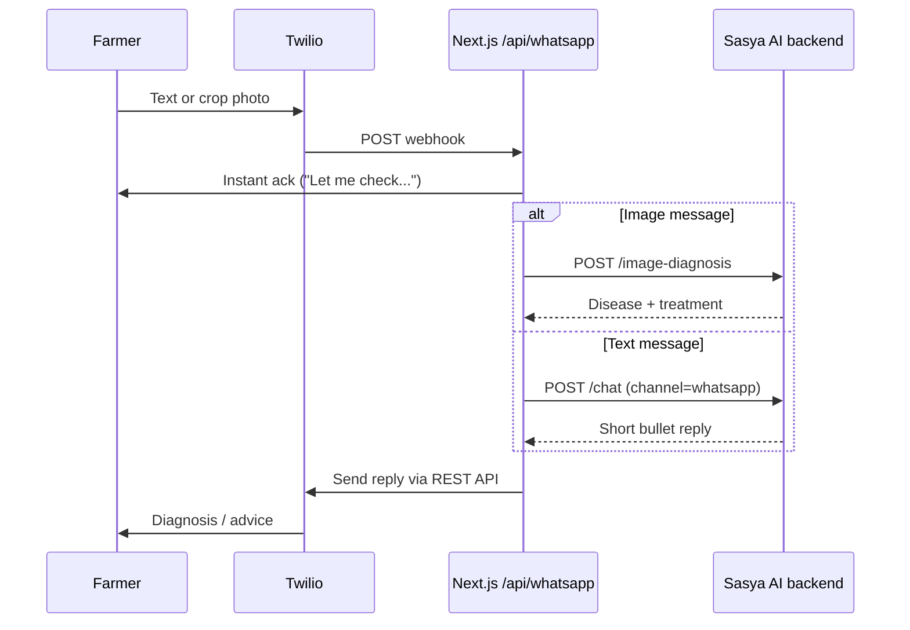

# Sasya AI / KrishiMitra — TETRA042

**AI-powered AgriTech platform for Indian farmers** — crop disease diagnosis, multilingual advisory, mandi prices, crop calendar, and farmer outreach through **web**, **voice (call agent)**, and **WhatsApp**.

Built for **TetraTHON** by Team **TETRA042**.

| Live backend API | https://neel2601-sasya-ai-backend.hf.space |
|------------------|--------------------------------------------|
| GitHub           | https://github.com/krushit1307/TETRA042    |

---

## Table of contents

- [Overview](#overview)
- [Key features](#key-features)
- [Architecture](#architecture)
- [Tech stack](#tech-stack)
- [Repository structure](#repository-structure)
- [Quick start](#quick-start)
- [Environment variables](#environment-variables)
- [Web assistant](#web-assistant)
- [Call agent (voice)](#call-agent-voice)
- [WhatsApp agent](#whatsapp-agent)
- [Backend API](#backend-api)
- [Models](#models)
- [Deployment](#deployment)
- [Team](#team)

---

## Overview

KrishiMitra (frontend) connects farmers to **Sasya AI** (backend) — a FastAPI service running on Hugging Face with:

- **EfficientNet-V2** for leaf disease detection (38 crop/disease classes)
- **TinyLlama + LoRA** for grounded advisory (RAG over agricultural knowledge)
- **NLLB-200** for translation across 10+ Indian languages
- **Whisper** for speech-to-text
- **TTS** via ElevenLabs (optional) → edge-tts → gTTS

Farmers can interact through the **website**, **voice mic on the assistant page**, or **WhatsApp** — all powered by the same advisory pipeline with channel-specific formatting (`web`, `voice`, `whatsapp`).

---

## Key features

| Feature | Description |
|---------|-------------|
| **Image diagnosis** | Upload a crop leaf photo → disease name, confidence, cause, treatment, prevention (translated to selected language) |
| **Multilingual chat** | Ask in English, Hindi, Gujarati, Marathi, Tamil, Telugu, Kannada, Bengali, Odia, Punjabi |
| **Call agent (voice)** | Speak into the mic → Whisper STT → AI answer → spoken TTS reply; backend `/voice-chat` for phone-style short answers |
| **WhatsApp agent** | Farmers message or send crop photos on WhatsApp → Twilio webhook → Sasya AI → reply with diagnosis or advice |
| **Market yard** | Live mandi prices from [data.gov.in](https://data.gov.in) Agmarknet API (state → district → market) |
| **Crop calendar** | Seasonal sowing/harvest guidance by state and soil type |
| **Agri news** | Curated farming news with multilingual support |
| **Admin panel** | News management for team |

---

## Architecture



**Advisory pipeline (chat / voice / WhatsApp):**

1. Detect or accept user language (NLLB if needed)
2. Translate query to English
3. Retrieve facts from knowledge base + `disease_info.json`
4. TinyLlama rewrites grounded answer (no hallucination)
5. Translate back to farmer's language
6. Format for channel: bullets (web), short sentences (voice), compact text (WhatsApp)

---

## Tech stack

| Layer | Technologies |
|-------|--------------|
| **Frontend** | Next.js 16, React 18, TypeScript, Tailwind CSS, Framer Motion, Radix UI |
| **Backend** | FastAPI, PyTorch, Hugging Face Transformers, Gradio (HF Space UI) |
| **ML models** | EfficientNet-V2, TinyLlama-1.1B + LoRA, NLLB-200-distilled-600M, Whisper-small |
| **Voice** | Whisper STT, ElevenLabs / edge-tts / gTTS |
| **WhatsApp** | Twilio WhatsApp Sandbox / Business API |
| **Market data** | data.gov.in Agmarknet API |
| **Deploy** | Hugging Face Spaces (backend), Vercel / static export (frontend) |

---

## Repository structure

```
TETRA042/
├── README.md                 # This file
├── frontend/                 # KrishiMitra web app (Next.js)
│   ├── app/
│   │   ├── api/whatsapp/     # Twilio WhatsApp webhook (server route)
│   │   ├── market-yard/      # Mandi prices
│   │   ├── calendar/         # Crop calendar
│   │   ├── news/             # Agri news
│   │   └── admin/            # News admin
│   ├── components/pages/     # Assistant, diagnosis, home, features…
│   └── lib/                  # API client, i18n, market-api
└── backend/                  # Sasya AI API (FastAPI + Gradio)
    ├── app/
    │   ├── routes/           # health, diagnose, speech
    │   └── services/         # disease, chat, advisory, tts, speech
    ├── Dockerfile            # HF Space deployment
    └── space.py              # HF entry point
```

---

## Quick start

### Prerequisites

- **Node.js** 18+ and **npm**
- **Python** 3.10+ (only if running backend locally)
- API keys: [data.gov.in](https://data.gov.in) (mandi), optional Twilio (WhatsApp), optional ElevenLabs (premium TTS)

### 1. Frontend (recommended — uses hosted backend)

```bash
cd frontend
npm install
cp .env.example .env.local
```

Edit `frontend/.env.local`:

```env
NEXT_PUBLIC_API_URL=https://neel2601-sasya-ai-backend.hf.space
NEXT_PUBLIC_DATA_GOV_API_KEY=your-data-gov-api-key
```

```bash
npm run dev
```

Open http://localhost:3000

### 2. Backend (optional — local API)

```bash
cd backend
python -m venv .venv
.venv\Scripts\activate          # Windows
# source .venv/bin/activate     # macOS / Linux
pip install -r requirements.txt
pip install torch torchvision --index-url https://download.pytorch.org/whl/cpu
cp .env.example .env
python -m uvicorn space:app --host 0.0.0.0 --port 7860
```

- API docs: http://localhost:7860/docs  
- Gradio UI: http://localhost:7860/

Point frontend to local backend:

```env
NEXT_PUBLIC_API_URL=http://localhost:7860
```

See [backend/README.md](backend/README.md) for model download and knowledge-base setup.

---

## Environment variables

### Frontend (`frontend/.env.local`)

| Variable | Required | Description |
|----------|----------|-------------|
| `NEXT_PUBLIC_API_URL` | Yes | Sasya AI backend URL |
| `NEXT_PUBLIC_DATA_GOV_API_KEY` | Yes (market yard) | data.gov.in API key — must be `NEXT_PUBLIC_` (browser fetch) |
| `TWILIO_ACCOUNT_SID` | WhatsApp only | Twilio account SID |
| `TWILIO_AUTH_TOKEN` | WhatsApp only | Twilio auth token |

Copy from `.env.example` — **never commit** `.env.local`.

### Backend (`backend/.env`)

| Variable | Required | Description |
|----------|----------|-------------|
| `HF_TOKEN` | Optional | Hugging Face token for private model repos |
| `ELEVENLABS_API_KEY` | Optional | Premium TTS (falls back to edge-tts / gTTS) |
| `ELEVENLABS_VOICE_ID` | Optional | ElevenLabs voice ID |
| `PORT` | Optional | Default `7860` |

---

## Web assistant

**Path:** Home → **Assistant** (`/?page=assistant`)

- Type or **speak** a farming question (mic button)
- Optional language selector (auto-detect if blank)
- Upload crop images for inline diagnosis
- AI replies in the selected language with optional **audio playback**

**Example questions:**

- English: *"My tomato plants have yellow spots on the lower leaves. What disease is this and how do I treat it?"*
- Gujarati: *"મારા કપાસના છોડ પર પાન કરચલા થઈ ગયા છે અને કીડા દેખાય છે. આનો ઉપચાર શું છે?"*

---

## Call agent (voice)

The **call agent** lets farmers talk instead of type — designed for low-literacy and hands-free use in the field.

### Web voice (built-in)

1. Open **Assistant** → tap the **microphone**
2. Speak in Hindi, Gujarati, English, etc.
3. Audio → `POST /speech-to-text` (Whisper)
4. Text → `POST /chat` with `channel=web`
5. Reply → `POST /text-to-speech` (auto-play if enabled)

### Backend voice API (for phone / integrations)

| Endpoint | Method | Description |
|----------|--------|-------------|
| `/voice-chat` | POST | Audio in → transcript + short spoken-style answer (`channel=voice`) |
| `/voice-diagnosis` | POST | Audio + leaf image → diagnosis + voice answer |
| `/text-to-speech` | POST | Text → MP3 audio |

**Voice channel formatting:** answers are 2–3 short sentences (no bullet symbols), optimized for phone calls.

**Optional ElevenLabs:** set `ELEVENLABS_API_KEY` on the backend for higher-quality TTS.

```bash
# Example: voice chat (curl)
curl -X POST "https://neel2601-sasya-ai-backend.hf.space/voice-chat" \
  -F "audio_file=@question.wav" \
  -F "language=hi" \
  -F "channel=voice" \
  -F "return_audio=true"
```

---

## WhatsApp agent

Farmers can reach KrishiMitra on **WhatsApp** via **Twilio** — no app install required.

**Webhook:** `POST /api/whatsapp` (Next.js route in `frontend/app/api/whatsapp/route.ts`)

### Flow



### Setup (Twilio WhatsApp Sandbox)

1. Create a [Twilio](https://www.twilio.com) account
2. Enable **WhatsApp Sandbox** (Console → Messaging → Try WhatsApp)
3. Add to `frontend/.env.local`:

```env
TWILIO_ACCOUNT_SID=ACxxxxxxxxxxxxxxxxxxxxxxxxxxxxxxxx
TWILIO_AUTH_TOKEN=your_auth_token
```

4. Deploy frontend to **Vercel** (or any Node host with serverless API routes)
5. Set webhook URL in Twilio: `https://your-domain.com/api/whatsapp` (POST)
6. Join sandbox from your phone (Twilio gives a `join <code>` message)

### What farmers can do on WhatsApp

| Message type | Backend call | Response |
|--------------|--------------|----------|
| Text question | `/chat` (`channel=whatsapp`) | 2 short bullet points |
| Crop photo | `/image-diagnosis` | Disease, confidence, cause, treatment, prevention |
| Photo + caption | `/image-diagnosis` + `explain=true` | Diagnosis + AI advisory |

> **Note:** The default `output: 'export'` in `next.config.mjs` is for static hosting. The WhatsApp webhook needs a **server** — deploy on Vercel (remove `output: 'export'`) or run `npm run dev` / `next start` locally with ngrok for testing.

---

## Backend API

**Base URL:** `https://neel2601-sasya-ai-backend.hf.space`

| Endpoint | Method | Description |
|----------|--------|-------------|
| `/health` | GET | Service health + model status |
| `/image-diagnosis` | POST | Leaf image → disease JSON (+ optional `explain`) |
| `/chat` | POST | Text Q&A — form: `message`, `lang`, `channel` (`web` / `whatsapp` / `voice`) |
| `/speech-to-text` | POST | Audio file → transcript |
| `/translate` | POST | NLLB translation |
| `/text-to-speech` | POST | Text → MP3 |
| `/voice-chat` | POST | Audio → advisory (voice channel) |
| `/voice-diagnosis` | POST | Audio + image → diagnosis + advisory |

Interactive docs: https://neel2601-sasya-ai-backend.hf.space/docs

---

## Models

| Component | Hugging Face / source |
|-----------|------------------------|
| Disease CNN | `Neel2601/sasya-disease-v2` |
| TinyLlama LoRA | `Neel2601/tinyllama-agricultural-adapter` |
| Translation | `facebook/nllb-200-distilled-600M` |
| Speech-to-text | `openai/whisper-small` |

**Knowledge base (RAG):** `trained_models/agricultural_tinyllama/agricultural_kb.json` (~66 MB) — not in git. Disease detection works without it; chat uses `disease_info.json` + fallback when KB is missing.

---

## Deployment

### Backend → Hugging Face Space

1. Push `backend/` to a Docker Space (see `backend/Dockerfile`)
2. Set `HF_TOKEN` if using private repos
3. Optional: `ELEVENLABS_API_KEY` for TTS

**Live Space:** https://neel2601-sasya-ai-backend.hf.space

### Frontend → Vercel (recommended for WhatsApp)

1. Connect GitHub repo, set root to `frontend/`
2. Environment variables:
   - `NEXT_PUBLIC_API_URL`
   - `NEXT_PUBLIC_DATA_GOV_API_KEY`
   - `TWILIO_ACCOUNT_SID`, `TWILIO_AUTH_TOKEN` (WhatsApp)
3. For WhatsApp webhook: use Vercel serverless (remove `output: 'export'` from `next.config.mjs` or use a separate API deployment)

### Frontend → static export

```bash
cd frontend && npm run build
```

Outputs static files to `out/` — works for web + diagnosis + market yard; **WhatsApp API route will not run** on pure static hosts.

---

## Team

**TETRA042** — TetraTHON AgriTech

| Role | Focus |
|------|-------|
| AI / Backend | Disease CNN, TinyLlama RAG, NLLB pipeline, HF deployment |
| Frontend | KrishiMitra UI, i18n, market yard, calendar, WhatsApp integration |
| Voice / Outreach | Call agent, Twilio WhatsApp agent, farmer UX |

---

## License & data

- Repository is **public** for hackathon / team collaboration
- Do **not** commit: `.env.local`, API keys, `data/`, model weights, `agricultural_kb.json`
- Mandi data © [data.gov.in](https://data.gov.in) / Agmarknet

---

## Related docs

- [backend/README.md](backend/README.md) — local backend setup, KB placement, HF deploy
- [frontend/design.md](frontend/design.md) — product design notes
- [frontend/requirements.md](frontend/requirements.md) — functional requirements
